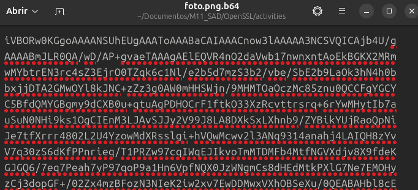

# OPENSSL SOLUCIONES

1. -a)  Codifica una imatge PNG qualsevol que tinguis disponible al sistema en Base64. Això ho pots fer executant la comanda `openssl enc -e -a -in foto.png -out foto.png.b64` (en aquest exemple la imatge s'anomena "foto.png"). ¿Quin és el contingut de l'arxiu "foto.png.b64" (obre'l amb un editor de text)?


```bash
bonilla@bonilla ~/D/M/O/activities (main)> openssl enc -e -a -in foto.png -out foto.png.b64
bonilla@bonilla ~/D/M/O/activities (main)> ll
total 128K
-rw-rw-r-- 1 bonilla bonilla 13K nov 21 20:10 foto.png
-rw-rw-r-- 1 bonilla bonilla 18K nov 21 20:12 foto.png.b64
-rw-rw-r-- 1 bonilla bonilla 88K nov 21 20:06 openssl_exercicis.pdf
-rw-rw-r-- 1 bonilla bonilla 359 nov 21 20:11 openssl_soluciones.md
```
- Aquest es el contingut del arxiu `foto.png.64`.


