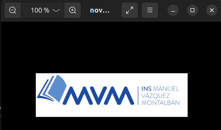

# OPENSSL SOLUCIONES

### EXERICICI 1 
a)  Codifica una imatge PNG qualsevol que tinguis disponible al sistema en Base64. Això ho pots fer executant la comanda `openssl enc -e -a -in foto.png -out foto.png.b64` (en aquest exemple la imatge s'anomena "foto.png"). ¿Quin és el contingut de l'arxiu "foto.png.b64" (obre'l amb un editor de text)?


```bash
bonilla@bonilla ~/D/M/O/activities (main)> openssl enc -e -a -in foto.png -out foto.png.b64
bonilla@bonilla ~/D/M/O/activities (main)> ll
total 128K
-rw-rw-r-- 1 bonilla bonilla 13K nov 21 20:10 foto.png
-rw-rw-r-- 1 bonilla bonilla 18K nov 21 20:12 foto.png.b64
-rw-rw-r-- 1 bonilla bonilla 88K nov 21 20:06 openssl_exercicis.pdf
-rw-rw-r-- 1 bonilla bonilla 359 nov 21 20:11 openssl_soluciones.md
```
- Aquest es el contingut del arxiu `foto.png.64`.


b) Elimina uns quants caràcters qualssevol ubicats al mig del contingut de "foto.png.b64" (ha de ser al mig per tal de no modificar el "magic number" del fitxer) i genera la imatge corresponent a partir d'aquest fitxer modificat executant la comanda `openssl enc -d -a -in foto.png.b64 -out novafoto.png`  Intenta obrir amb un visor de fotos (per exemple, "eog") el fitxer "novafoto.png". ¿Què veus? ¿Què et diu la comanda file novafoto.png?

```bash
bonilla@bonilla ~/D/M/O/activities (main)> openssl enc -d -a -in foto.png.b64 -out novafoto.png
bonilla@bonilla ~/D/M/O/activities (main)> ll
total 244K
-rw-rw-r-- 1 bonilla bonilla  97K nov 21 20:14 foto_fotobase64.png
-rw-rw-r-- 1 bonilla bonilla  13K nov 21 20:10 foto.png
-rw-rw-r-- 1 bonilla bonilla  18K nov 21 20:19 foto.png.b64
-rw-rw-r-- 1 bonilla bonilla  13K nov 21 20:20 novafoto.png
-rw-rw-r-- 1 bonilla bonilla  88K nov 21 20:06 openssl_exercicis.pdf
-rw-rw-r-- 1 bonilla bonilla 1,3K nov 21 20:19 openssl_soluciones.md
```
- Pel tipus de ubuntu no es pot obrir.


c) Torna a repetir l'apartat a) i tot seguit torna a executar, sense que hagis modificat res de `foto.png.b64`, la mateixa comanda openssl indicada a l'apartat b). ¿Què veus ara si obres "nova.foto.png" amb el visor de fotos?

```bash
bonilla@bonilla ~/D/M/O/activities (main)> openssl enc -e -a -in foto.png -out foto.png.b64
bonilla@bonilla ~/D/M/O/activities (main)> ll
total 148K
-rw-rw-r-- 1 bonilla bonilla  13K nov 21 20:10 foto.png
-rw-rw-r-- 1 bonilla bonilla  18K nov 21 22:42 foto.png.b64
drwxrwxr-x 2 bonilla bonilla 4,0K nov 21 20:21 fotos_md/
-rw-rw-r-- 1 bonilla bonilla  13K nov 21 20:20 novafoto.png
-rw-rw-r-- 1 bonilla bonilla  88K nov 21 20:06 openssl_exercicis.pdf
-rw-rw-r-- 1 bonilla bonilla 2,2K nov 21 22:30 openssl_soluciones.md
```
```bash
bonilla@bonilla ~/D/M/O/activities (main)> openssl enc -d -a -in foto.png.b64 -out novafoto.png
bonilla@bonilla ~/D/M/O/activities (main)> ll
total 148K
-rw-rw-r-- 1 bonilla bonilla  13K nov 21 20:10 foto.png
-rw-rw-r-- 1 bonilla bonilla  18K nov 21 22:42 foto.png.b64
drwxrwxr-x 2 bonilla bonilla 4,0K nov 21 20:21 fotos_md/
-rw-rw-r-- 1 bonilla bonilla  13K nov 21 22:44 novafoto.png
-rw-rw-r-- 1 bonilla bonilla  88K nov 21 20:06 openssl_exercicis.pdf
-rw-rw-r-- 1 bonilla bonilla 2,7K nov 21 22:43 openssl_soluciones.md
```

- Aquest es el resultat de la nova foto:




d) Executa la comanda `echo "VmlzY2EgbGEgbXVudGFueWE=" | openssl enc -d -a` ¿Què veus a pantalla i per què? ¿I si ara executes la comanda `echo "Vm1selkyRWdiR0VnYlhWdWRHRnVlV0U9Cg==" | openssl enc -d -a | openssl enc -d -a` ?

Si executo la comanda:
```bash
echo "VmlzY2EgbGEgbXVudGFueWE=" | openssl enc -d -a
```
Em surt la següent frase:


I si executo la comanda:
```bash
echo "Vm1selkyRWdiR0VnYlhWdWRHRnVlV0U9Cg==" | openssl enc -d -a | openssl enc -d -a
```

Em surt la mateixa imatge:


dII) Edita un arxiu anomenat "breaker.py" amb el següent contingut i dóna-li permisos d'execució. D'altra banda, crea un altre arxiu anomenat "missatgecodificat.txt" contenint la mateixa cadena emprada a l'apartat anterior (és a dir, sense cometes: "Vm1selkyRWdiR0VnYlhWdWRHRnVlV0U9Cg==") ¿Per a què serveix aquest codi? ¿Quina funció té el bucle allà indicat? ¿Quantes vegades l'hauràs de repetir fins trobar el missatge en clar? ¿Quin és?

```python
#!/usr/bin/python3
import base64
fitxer = open("missatgecodificat.txt", "r")
contingut= fitxer.read()
num = int(input("Indica el nombre de cops a fer:"))
for i in range(1,num+1):
     contingut=base64.b64decode(contingut)
     print(contingut)
```


Posem el .py en la carpeta breaker i també el missatge codificat:


El que fa el codi es decodificar el missatge mitjançant base64, he probat 1, 2 i fins a 3 vegades y aquest es el resultat:


Com pots veure, al primer intent no decodifica res, al segón si, i al tercer dona un error.

